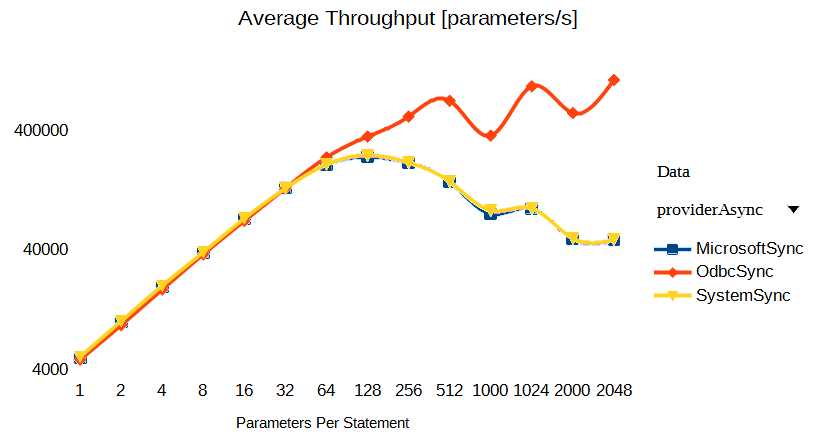
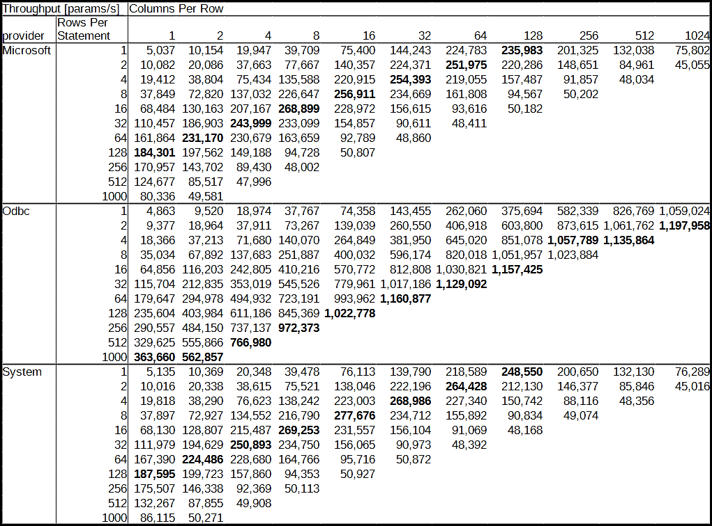

# Sql Batch Insert Performance

A SQL insert performance benchmark in .NET C# that:

- Uses `ExecuteNonQuery()` and placeholder parameters (named or positional) to insert single row or multi-row batches
- Varies the number of columns from 1 to 2048, and number of rows in each batch from 1 to 1000
- Each statement uses SQL-92 syntax:

  ```
  INSERT INTO tablename (column-a, [column-b, ...])
  VALUES (@r0_c0, [@r0_c1, ...]),
         (@r1_c0, [@r1_c1, ...]),
         ...
  ```


  ## Instructions

- At top of `BatchInsert.cs`:
  - Set connections strings _odbcCS and _sqlClientCS
  - If desired, define ASYNC, PREPARE, and/or TRANSACTION to also test those (I saw no 
    significant difference)
  - If needed, increase/decrease the `_scaleNumberOfStatements` constant to increase/decrease run times
- Run


# Conclusions

I've tested with .NET5.0 and a local SQL Server 2019 database.

In the tests below I find a quite significant issue with performance (measured as **inserted 
parameters per second**) with the `Microsoft.Data.SqlClient` and `System.Data.SqlClient` providers,
which is progressively reduced from about 50 parameters per statement:



Here are the detailed numbers, with the best numbers in bold:



- Performance starts being limited by this issue at about 50 parameters per insert statement
- Inserts reach peak performance at about 128 parameters per insert statement
- With >128 parameters per insert statement, performance is increasingly reduced, 
  with 2048 parameters being up to 7 times slower than with 128 parameters
- With 128 or more parameters, the SQL Server process seems bottlenecked on CPU, maxing out one core
- `Microsoft.Data.SqlClient` and `System.Data.SqlClient` both show the same issue
- It also affects single row inserts (i.e. no batch), where `M.D.SqlClient` and `S.D.SqlClient` 
  are 3.5 times slower at 1024 parameters vs. peak performance at 128 parameters
- Using `async` (with `ExecuteNonQueryAsync()`) and using `IDbCommand.Prepare()` does not 
  improve the performance
- The `System.Data.Odbc’ provider does not show this issue, and therefore has up to 25 times 
  better performance than `M.D.SqlClient` and `S.D.SqlClient` (at 2048 parameters per statement)
- Providers for other databases (tested, but not included in these results: 
  `MySql.Data.MySqlClient`, `MySqlConnector`, `Npgsql`, `System.Data.SQLite`, some of which 
  also use named parameters) also do not have this issue

Microsoft has a guideline that says 
[use batch insert if <100 rows](https://docs.microsoft.com/en-us/azure/azure-sql/performance-improve-use-batching#recommendation-summary).
This seems to be poor advice if you have wide rows. It would be better stated as
_use batch insert if <100 **parameters**_. As that article points out, for larger volumes
you get better performance via table valued parameters or bulk inserts.


## Test Results

``` ini

BenchmarkDotNet=v0.12.1, OS=Windows 10.0.19042
Intel Core i7-4770K CPU 3.50GHz (Haswell), 1 CPU, 4 logical and 4 physical cores
.NET Core SDK=5.0.103
  [Host]   : .NET Core 5.0.3 (CoreCLR 5.0.321.7212, CoreFX 5.0.321.7212), X64 RyuJIT
  ShortRun : .NET Core 5.0.3 (CoreCLR 5.0.321.7212, CoreFX 5.0.321.7212), X64 RyuJIT

Job=ShortRun  IterationCount=3  LaunchCount=1  
WarmupCount=3  

```
| providerAsync | rowsPerStatement | columnsPerRow | numberOfStatements |      Mean |      Error |    StdDev | Throughput [params/s] | Throughput [rows/s] |
|-------------- |----------------- |-------------- |------------------- |----------:|-----------:|----------:|----------------------:|--------------------:|
| **MicrosoftSync** |                **1** |             **1** |                **800** | **158.81 ms** |  **37.250 ms** |  **2.042 ms** |                  **5037** |                **5037** |
| **MicrosoftSync** |                **1** |             **2** |               **1049** | **206.62 ms** |  **23.500 ms** |  **1.288 ms** |                 **10154** |                **5077** |
| **MicrosoftSync** |                **1** |             **4** |               **1000** | **200.54 ms** |  **25.796 ms** |  **1.414 ms** |                 **19947** |                **4987** |
| **MicrosoftSync** |                **1** |             **8** |                **848** | **170.84 ms** |  **16.493 ms** |  **0.904 ms** |                 **39709** |                **4964** |
| **MicrosoftSync** |                **1** |            **16** |                **679** | **144.08 ms** |  **30.070 ms** |  **1.648 ms** |                 **75400** |                **4713** |
| **MicrosoftSync** |                **1** |            **32** |                **526** | **116.69 ms** |   **7.200 ms** |  **0.395 ms** |                **144243** |                **4508** |
| **MicrosoftSync** |                **1** |            **64** |                **399** | **113.60 ms** |  **15.656 ms** |  **0.858 ms** |                **224783** |                **3512** |
| **MicrosoftSync** |                **1** |           **128** |                **325** | **176.28 ms** |   **9.535 ms** |  **0.523 ms** |                **235983** |                **1844** |
| **MicrosoftSync** |                **1** |           **256** |                **153** | **194.55 ms** |   **8.118 ms** |  **0.445 ms** |                **201325** |                 **786** |
| **MicrosoftSync** |                **1** |           **512** |                 **67** | **259.80 ms** |   **8.238 ms** |  **0.452 ms** |                **132038** |                 **258** |
| **MicrosoftSync** |                **1** |          **1024** |                 **24** | **324.21 ms** |   **9.158 ms** |  **0.502 ms** |                 **75802** |                  **74** |
| **MicrosoftSync** |                **2** |             **1** |               **1049** | **208.09 ms** |  **12.316 ms** |  **0.675 ms** |                 **10082** |               **10082** |
| **MicrosoftSync** |                **2** |             **2** |               **1000** | **199.14 ms** |   **9.892 ms** |  **0.542 ms** |                 **20086** |               **10043** |
| **MicrosoftSync** |                **2** |             **4** |                **848** | **180.12 ms** |  **39.910 ms** |  **2.188 ms** |                 **37663** |                **9416** |
| **MicrosoftSync** |                **2** |             **8** |                **679** | **139.88 ms** |   **7.616 ms** |  **0.417 ms** |                 **77667** |                **9708** |
| **MicrosoftSync** |                **2** |            **16** |                **526** | **119.92 ms** |  **27.367 ms** |  **1.500 ms** |                **140357** |                **8772** |
| **MicrosoftSync** |                **2** |            **32** |                **399** | **113.81 ms** |  **14.236 ms** |  **0.780 ms** |                **224371** |                **7012** |
| **MicrosoftSync** |                **2** |            **64** |                **325** | **165.10 ms** |   **1.023 ms** |  **0.056 ms** |                **251975** |                **3937** |
| **MicrosoftSync** |                **2** |           **128** |                **153** | **177.81 ms** |  **23.887 ms** |  **1.309 ms** |                **220286** |                **1721** |
| **MicrosoftSync** |                **2** |           **256** |                 **67** | **230.77 ms** |   **6.003 ms** |  **0.329 ms** |                **148651** |                 **581** |
| **MicrosoftSync** |                **2** |           **512** |                 **24** | **289.26 ms** |  **21.855 ms** |  **1.198 ms** |                 **84961** |                 **166** |
| **MicrosoftSync** |                **2** |          **1024** |                  **3** | **136.37 ms** |   **4.091 ms** |  **0.224 ms** |                 **45055** |                  **44** |
| **MicrosoftSync** |                **4** |             **1** |               **1000** | **206.06 ms** |  **36.688 ms** |  **2.011 ms** |                 **19412** |               **19412** |
| **MicrosoftSync** |                **4** |             **2** |                **848** | **174.83 ms** |  **21.395 ms** |  **1.173 ms** |                 **38804** |               **19402** |
| **MicrosoftSync** |                **4** |             **4** |                **679** | **144.02 ms** |  **15.661 ms** |  **0.858 ms** |                 **75434** |               **18859** |
| **MicrosoftSync** |                **4** |             **8** |                **526** | **124.14 ms** |  **86.268 ms** |  **4.729 ms** |                **135588** |               **16948** |
| **MicrosoftSync** |                **4** |            **16** |                **399** | **115.59 ms** |  **18.749 ms** |  **1.028 ms** |                **220915** |               **13807** |
| **MicrosoftSync** |                **4** |            **32** |                **325** | **163.53 ms** |  **31.603 ms** |  **1.732 ms** |                **254393** |                **7950** |
| **MicrosoftSync** |                **4** |            **64** |                **153** | **178.80 ms** |  **11.680 ms** |  **0.640 ms** |                **219055** |                **3423** |
| **MicrosoftSync** |                **4** |           **128** |                 **67** | **217.82 ms** |   **8.324 ms** |  **0.456 ms** |                **157487** |                **1230** |
| **MicrosoftSync** |                **4** |           **256** |                 **24** | **267.55 ms** |  **15.447 ms** |  **0.847 ms** |                 **91857** |                 **359** |
| **MicrosoftSync** |                **4** |           **512** |                  **3** | **127.91 ms** |  **12.287 ms** |  **0.673 ms** |                 **48034** |                  **94** |
| **MicrosoftSync** |                **8** |             **1** |                **848** | **179.24 ms** |  **10.878 ms** |  **0.596 ms** |                 **37849** |               **37849** |
| **MicrosoftSync** |                **8** |             **2** |                **679** | **149.19 ms** |  **24.459 ms** |  **1.341 ms** |                 **72820** |               **36410** |
| **MicrosoftSync** |                **8** |             **4** |                **526** | **122.83 ms** |  **15.448 ms** |  **0.847 ms** |                **137032** |               **34258** |
| **MicrosoftSync** |                **8** |             **8** |                **399** | **112.67 ms** |   **6.802 ms** |  **0.373 ms** |                **226647** |               **28331** |
| **MicrosoftSync** |                **8** |            **16** |                **325** | **161.92 ms** |  **80.991 ms** |  **4.439 ms** |                **256911** |               **16057** |
| **MicrosoftSync** |                **8** |            **32** |                **153** | **166.91 ms** | **137.716 ms** |  **7.549 ms** |                **234669** |                **7333** |
| **MicrosoftSync** |                **8** |            **64** |                 **67** | **212.00 ms** |  **23.592 ms** |  **1.293 ms** |                **161808** |                **2528** |
| **MicrosoftSync** |                **8** |           **128** |                 **24** | **259.88 ms** |  **19.262 ms** |  **1.056 ms** |                 **94567** |                 **739** |
| **MicrosoftSync** |                **8** |           **256** |                  **3** | **122.38 ms** |   **5.911 ms** |  **0.324 ms** |                 **50202** |                 **196** |
| **MicrosoftSync** |               **16** |             **1** |                **679** | **158.64 ms** |   **2.144 ms** |  **0.118 ms** |                 **68484** |               **68484** |
| **MicrosoftSync** |               **16** |             **2** |                **526** | **129.32 ms** |  **11.328 ms** |  **0.621 ms** |                **130163** |               **65081** |
| **MicrosoftSync** |               **16** |             **4** |                **399** | **123.26 ms** |  **74.689 ms** |  **4.094 ms** |                **207167** |               **51792** |
| **MicrosoftSync** |               **16** |             **8** |                **325** | **154.71 ms** |  **38.390 ms** |  **2.104 ms** |                **268899** |               **33612** |
| **MicrosoftSync** |               **16** |            **16** |                **153** | **171.06 ms** |   **9.222 ms** |  **0.505 ms** |                **228972** |               **14311** |
| **MicrosoftSync** |               **16** |            **32** |                 **67** | **219.03 ms** |  **54.853 ms** |  **3.007 ms** |                **156615** |                **4894** |
| **MicrosoftSync** |               **16** |            **64** |                 **24** | **262.52 ms** |  **48.654 ms** |  **2.667 ms** |                 **93616** |                **1463** |
| **MicrosoftSync** |               **16** |           **128** |                  **3** | **122.43 ms** |   **2.828 ms** |  **0.155 ms** |                 **50182** |                 **392** |
| **MicrosoftSync** |               **32** |             **1** |                **526** | **152.38 ms** |  **69.036 ms** |  **3.784 ms** |                **110457** |              **110457** |
| **MicrosoftSync** |               **32** |             **2** |                **399** | **136.63 ms** |  **11.013 ms** |  **0.604 ms** |                **186903** |               **93451** |
| **MicrosoftSync** |               **32** |             **4** |                **325** | **170.49 ms** |  **40.280 ms** |  **2.208 ms** |                **243999** |               **61000** |
| **MicrosoftSync** |               **32** |             **8** |                **153** | **168.03 ms** |   **5.170 ms** |  **0.283 ms** |                **233099** |               **29137** |
| **MicrosoftSync** |               **32** |            **16** |                 **67** | **221.52 ms** |  **14.479 ms** |  **0.794 ms** |                **154857** |                **9679** |
| **MicrosoftSync** |               **32** |            **32** |                 **24** | **271.23 ms** |   **7.038 ms** |  **0.386 ms** |                 **90611** |                **2832** |
| **MicrosoftSync** |               **32** |            **64** |                  **3** | **126.91 ms** |   **9.770 ms** |  **0.536 ms** |                 **48411** |                 **756** |
| **MicrosoftSync** |               **64** |             **1** |                **399** | **157.76 ms** |  **10.055 ms** |  **0.551 ms** |                **161864** |              **161864** |
| **MicrosoftSync** |               **64** |             **2** |                **325** | **179.95 ms** |  **16.051 ms** |  **0.880 ms** |                **231170** |              **115585** |
| **MicrosoftSync** |               **64** |             **4** |                **153** | **169.79 ms** |   **9.878 ms** |  **0.541 ms** |                **230679** |               **57670** |
| **MicrosoftSync** |               **64** |             **8** |                 **67** | **209.61 ms** |  **13.999 ms** |  **0.767 ms** |                **163659** |               **20457** |
| **MicrosoftSync** |               **64** |            **16** |                 **24** | **264.86 ms** |  **46.066 ms** |  **2.525 ms** |                 **92789** |                **5799** |
| **MicrosoftSync** |               **64** |            **32** |                  **3** | **125.75 ms** |   **7.520 ms** |  **0.412 ms** |                 **48860** |                **1527** |
| **MicrosoftSync** |              **128** |             **1** |                **325** | **225.72 ms** |  **38.489 ms** |  **2.110 ms** |                **184301** |              **184301** |
| **MicrosoftSync** |              **128** |             **2** |                **153** | **198.26 ms** |  **31.494 ms** |  **1.726 ms** |                **197562** |               **98781** |
| **MicrosoftSync** |              **128** |             **4** |                 **67** | **229.94 ms** |   **7.064 ms** |  **0.387 ms** |                **149188** |               **37297** |
| **MicrosoftSync** |              **128** |             **8** |                 **24** | **259.44 ms** |  **37.410 ms** |  **2.051 ms** |                 **94728** |               **11841** |
| **MicrosoftSync** |              **128** |            **16** |                  **3** | **120.93 ms** |   **6.896 ms** |  **0.378 ms** |                 **50807** |                **3175** |
| **MicrosoftSync** |              **256** |             **1** |                **153** | **229.11 ms** |  **61.015 ms** |  **3.344 ms** |                **170957** |              **170957** |
| **MicrosoftSync** |              **256** |             **2** |                 **67** | **238.72 ms** | **108.283 ms** |  **5.935 ms** |                **143702** |               **71851** |
| **MicrosoftSync** |              **256** |             **4** |                 **24** | **274.81 ms** | **107.012 ms** |  **5.866 ms** |                 **89430** |               **22357** |
| **MicrosoftSync** |              **256** |             **8** |                  **3** | **128.00 ms** |   **8.527 ms** |  **0.467 ms** |                 **48002** |                **6000** |
| **MicrosoftSync** |              **512** |             **1** |                 **67** | **275.14 ms** |  **50.970 ms** |  **2.794 ms** |                **124677** |              **124677** |
| **MicrosoftSync** |              **512** |             **2** |                 **24** | **287.38 ms** |   **5.329 ms** |  **0.292 ms** |                 **85517** |               **42758** |
| **MicrosoftSync** |              **512** |             **4** |                  **3** | **128.01 ms** |   **8.426 ms** |  **0.462 ms** |                 **47996** |               **11999** |
| **MicrosoftSync** |             **1000** |             **1** |                 **25** | **311.19 ms** | **163.562 ms** |  **8.965 ms** |                 **80336** |               **80336** |
| **MicrosoftSync** |             **1000** |             **2** |                  **3** | **121.01 ms** |  **49.775 ms** |  **2.728 ms** |                 **49581** |               **24790** |
|    **SystemSync** |                **1** |             **1** |                **800** | **155.79 ms** |   **2.915 ms** |  **0.160 ms** |                  **5135** |                **5135** |
|    **SystemSync** |                **1** |             **2** |               **1049** | **202.32 ms** |   **7.799 ms** |  **0.427 ms** |                 **10369** |                **5185** |
|    **SystemSync** |                **1** |             **4** |               **1000** | **196.58 ms** |  **19.720 ms** |  **1.081 ms** |                 **20348** |                **5087** |
|    **SystemSync** |                **1** |             **8** |                **848** | **171.84 ms** |  **28.781 ms** |  **1.578 ms** |                 **39478** |                **4935** |
|    **SystemSync** |                **1** |            **16** |                **679** | **142.73 ms** |   **2.963 ms** |  **0.162 ms** |                 **76113** |                **4757** |
|    **SystemSync** |                **1** |            **32** |                **526** | **120.41 ms** |   **3.186 ms** |  **0.175 ms** |                **139790** |                **4368** |
|    **SystemSync** |                **1** |            **64** |                **399** | **116.82 ms** |  **88.615 ms** |  **4.857 ms** |                **218589** |                **3415** |
|    **SystemSync** |                **1** |           **128** |                **325** | **167.37 ms** |  **41.454 ms** |  **2.272 ms** |                **248550** |                **1942** |
|    **SystemSync** |                **1** |           **256** |                **153** | **195.21 ms** |  **48.612 ms** |  **2.665 ms** |                **200650** |                 **784** |
|    **SystemSync** |                **1** |           **512** |                 **67** | **259.62 ms** |  **33.495 ms** |  **1.836 ms** |                **132130** |                 **258** |
|    **SystemSync** |                **1** |          **1024** |                 **24** | **322.14 ms** |  **12.727 ms** |  **0.698 ms** |                 **76289** |                  **75** |
|    **SystemSync** |                **2** |             **1** |               **1049** | **209.46 ms** |  **47.729 ms** |  **2.616 ms** |                 **10016** |               **10016** |
|    **SystemSync** |                **2** |             **2** |               **1000** | **196.67 ms** |  **19.805 ms** |  **1.086 ms** |                 **20338** |               **10169** |
|    **SystemSync** |                **2** |             **4** |                **848** | **175.68 ms** |  **36.995 ms** |  **2.028 ms** |                 **38615** |                **9654** |
|    **SystemSync** |                **2** |             **8** |                **679** | **143.85 ms** |   **5.528 ms** |  **0.303 ms** |                 **75521** |                **9440** |
|    **SystemSync** |                **2** |            **16** |                **526** | **121.93 ms** |   **3.872 ms** |  **0.212 ms** |                **138046** |                **8628** |
|    **SystemSync** |                **2** |            **32** |                **399** | **114.93 ms** |   **8.434 ms** |  **0.462 ms** |                **222196** |                **6944** |
|    **SystemSync** |                **2** |            **64** |                **325** | **157.32 ms** |  **20.236 ms** |  **1.109 ms** |                **264428** |                **4132** |
|    **SystemSync** |                **2** |           **128** |                **153** | **184.64 ms** |   **5.482 ms** |  **0.300 ms** |                **212130** |                **1657** |
|    **SystemSync** |                **2** |           **256** |                 **67** | **234.35 ms** |  **13.457 ms** |  **0.738 ms** |                **146377** |                 **572** |
|    **SystemSync** |                **2** |           **512** |                 **24** | **286.28 ms** |  **16.171 ms** |  **0.886 ms** |                 **85846** |                 **168** |
|    **SystemSync** |                **2** |          **1024** |                  **3** | **136.49 ms** |   **5.208 ms** |  **0.285 ms** |                 **45016** |                  **44** |
|    **SystemSync** |                **4** |             **1** |               **1000** | **201.83 ms** |  **27.603 ms** |  **1.513 ms** |                 **19818** |               **19818** |
|    **SystemSync** |                **4** |             **2** |                **848** | **177.17 ms** | **212.157 ms** | **11.629 ms** |                 **38290** |               **19145** |
|    **SystemSync** |                **4** |             **4** |                **679** | **141.78 ms** |   **8.483 ms** |  **0.465 ms** |                 **76623** |               **19156** |
|    **SystemSync** |                **4** |             **8** |                **526** | **121.76 ms** |  **25.313 ms** |  **1.388 ms** |                **138242** |               **17280** |
|    **SystemSync** |                **4** |            **16** |                **399** | **114.51 ms** |  **20.375 ms** |  **1.117 ms** |                **223003** |               **13938** |
|    **SystemSync** |                **4** |            **32** |                **325** | **154.66 ms** |   **4.129 ms** |  **0.226 ms** |                **268986** |                **8406** |
|    **SystemSync** |                **4** |            **64** |                **153** | **172.29 ms** |  **34.212 ms** |  **1.875 ms** |                **227340** |                **3552** |
|    **SystemSync** |                **4** |           **128** |                 **67** | **227.57 ms** |  **13.432 ms** |  **0.736 ms** |                **150742** |                **1178** |
|    **SystemSync** |                **4** |           **256** |                 **24** | **278.90 ms** |  **76.095 ms** |  **4.171 ms** |                 **88116** |                 **344** |
|    **SystemSync** |                **4** |           **512** |                  **3** | **127.06 ms** |   **2.078 ms** |  **0.114 ms** |                 **48356** |                  **94** |
|    **SystemSync** |                **8** |             **1** |                **848** | **179.01 ms** |  **10.841 ms** |  **0.594 ms** |                 **37897** |               **37897** |
|    **SystemSync** |                **8** |             **2** |                **679** | **148.97 ms** |  **25.218 ms** |  **1.382 ms** |                 **72927** |               **36464** |
|    **SystemSync** |                **8** |             **4** |                **526** | **125.10 ms** |  **34.307 ms** |  **1.880 ms** |                **134552** |               **33638** |
|    **SystemSync** |                **8** |             **8** |                **399** | **117.79 ms** |  **39.435 ms** |  **2.162 ms** |                **216790** |               **27099** |
|    **SystemSync** |                **8** |            **16** |                **325** | **149.81 ms** |  **48.855 ms** |  **2.678 ms** |                **277676** |               **17355** |
|    **SystemSync** |                **8** |            **32** |                **153** | **166.88 ms** |   **6.788 ms** |  **0.372 ms** |                **234712** |                **7335** |
|    **SystemSync** |                **8** |            **64** |                 **67** | **220.05 ms** |  **16.147 ms** |  **0.885 ms** |                **155892** |                **2436** |
|    **SystemSync** |                **8** |           **128** |                 **24** | **270.56 ms** |   **1.581 ms** |  **0.087 ms** |                 **90834** |                 **710** |
|    **SystemSync** |                **8** |           **256** |                  **3** | **125.20 ms** |  **44.497 ms** |  **2.439 ms** |                 **49074** |                 **192** |
|    **SystemSync** |               **16** |             **1** |                **679** | **159.46 ms** |  **19.945 ms** |  **1.093 ms** |                 **68130** |               **68130** |
|    **SystemSync** |               **16** |             **2** |                **526** | **130.68 ms** |   **5.777 ms** |  **0.317 ms** |                **128807** |               **64404** |
|    **SystemSync** |               **16** |             **4** |                **399** | **118.50 ms** |  **15.117 ms** |  **0.829 ms** |                **215487** |               **53872** |
|    **SystemSync** |               **16** |             **8** |                **325** | **154.50 ms** |  **55.119 ms** |  **3.021 ms** |                **269253** |               **33657** |
|    **SystemSync** |               **16** |            **16** |                **153** | **169.15 ms** |  **10.350 ms** |  **0.567 ms** |                **231557** |               **14472** |
|    **SystemSync** |               **16** |            **32** |                 **67** | **219.75 ms** |  **15.807 ms** |  **0.866 ms** |                **156104** |                **4878** |
|    **SystemSync** |               **16** |            **64** |                 **24** | **269.86 ms** |  **10.351 ms** |  **0.567 ms** |                 **91069** |                **1423** |
|    **SystemSync** |               **16** |           **128** |                  **3** | **127.55 ms** |   **8.777 ms** |  **0.481 ms** |                 **48168** |                 **376** |
|    **SystemSync** |               **32** |             **1** |                **526** | **150.31 ms** |  **40.813 ms** |  **2.237 ms** |                **111979** |              **111979** |
|    **SystemSync** |               **32** |             **2** |                **399** | **131.20 ms** |  **13.481 ms** |  **0.739 ms** |                **194629** |               **97315** |
|    **SystemSync** |               **32** |             **4** |                **325** | **165.81 ms** |  **12.363 ms** |  **0.678 ms** |                **250893** |               **62723** |
|    **SystemSync** |               **32** |             **8** |                **153** | **166.85 ms** |   **8.382 ms** |  **0.459 ms** |                **234750** |               **29344** |
|    **SystemSync** |               **32** |            **16** |                 **67** | **219.81 ms** |  **15.667 ms** |  **0.859 ms** |                **156065** |                **9754** |
|    **SystemSync** |               **32** |            **32** |                 **24** | **270.15 ms** |  **18.929 ms** |  **1.038 ms** |                 **90973** |                **2843** |
|    **SystemSync** |               **32** |            **64** |                  **3** | **126.96 ms** |   **6.023 ms** |  **0.330 ms** |                 **48392** |                 **756** |
|    **SystemSync** |               **64** |             **1** |                **399** | **152.55 ms** |  **35.613 ms** |  **1.952 ms** |                **167390** |              **167390** |
|    **SystemSync** |               **64** |             **2** |                **325** | **185.31 ms** |  **12.398 ms** |  **0.680 ms** |                **224486** |              **112243** |
|    **SystemSync** |               **64** |             **4** |                **153** | **171.28 ms** |  **33.313 ms** |  **1.826 ms** |                **228680** |               **57170** |
|    **SystemSync** |               **64** |             **8** |                 **67** | **208.20 ms** |  **12.554 ms** |  **0.688 ms** |                **164766** |               **20596** |
|    **SystemSync** |               **64** |            **16** |                 **24** | **256.76 ms** |   **2.494 ms** |  **0.137 ms** |                 **95716** |                **5982** |
|    **SystemSync** |               **64** |            **32** |                  **3** | **120.77 ms** |   **2.603 ms** |  **0.143 ms** |                 **50872** |                **1590** |
|    **SystemSync** |              **128** |             **1** |                **325** | **221.75 ms** |  **13.104 ms** |  **0.718 ms** |                **187595** |              **187595** |
|    **SystemSync** |              **128** |             **2** |                **153** | **196.11 ms** |  **11.588 ms** |  **0.635 ms** |                **199723** |               **99861** |
|    **SystemSync** |              **128** |             **4** |                 **67** | **217.31 ms** |   **4.966 ms** |  **0.272 ms** |                **157860** |               **39465** |
|    **SystemSync** |              **128** |             **8** |                 **24** | **260.47 ms** |  **31.556 ms** |  **1.730 ms** |                 **94353** |               **11794** |
|    **SystemSync** |              **128** |            **16** |                  **3** | **120.64 ms** |   **4.333 ms** |  **0.237 ms** |                 **50927** |                **3183** |
|    **SystemSync** |              **256** |             **1** |                **153** | **223.17 ms** |  **10.381 ms** |  **0.569 ms** |                **175507** |              **175507** |
|    **SystemSync** |              **256** |             **2** |                 **67** | **234.42 ms** |  **26.510 ms** |  **1.453 ms** |                **146338** |               **73169** |
|    **SystemSync** |              **256** |             **4** |                 **24** | **266.06 ms** |   **2.041 ms** |  **0.112 ms** |                 **92369** |               **23092** |
|    **SystemSync** |              **256** |             **8** |                  **3** | **122.60 ms** |   **3.393 ms** |  **0.186 ms** |                 **50113** |                **6264** |
|    **SystemSync** |              **512** |             **1** |                 **67** | **259.35 ms** |  **43.787 ms** |  **2.400 ms** |                **132267** |              **132267** |
|    **SystemSync** |              **512** |             **2** |                 **24** | **279.73 ms** | **183.546 ms** | **10.061 ms** |                 **87855** |               **43928** |
|    **SystemSync** |              **512** |             **4** |                  **3** | **123.11 ms** |   **3.495 ms** |  **0.192 ms** |                 **49908** |               **12477** |
|    **SystemSync** |             **1000** |             **1** |                 **25** | **290.31 ms** |  **13.755 ms** |  **0.754 ms** |                 **86115** |               **86115** |
|    **SystemSync** |             **1000** |             **2** |                  **3** | **119.35 ms** |  **13.027 ms** |  **0.714 ms** |                 **50271** |               **25136** |
|      **OdbcSync** |                **1** |             **1** |                **800** | **164.51 ms** |  **10.081 ms** |  **0.553 ms** |                  **4863** |                **4863** |
|      **OdbcSync** |                **1** |             **2** |               **1049** | **220.37 ms** |  **25.020 ms** |  **1.371 ms** |                  **9520** |                **4760** |
|      **OdbcSync** |                **1** |             **4** |               **1000** | **210.82 ms** |   **8.950 ms** |  **0.491 ms** |                 **18974** |                **4743** |
|      **OdbcSync** |                **1** |             **8** |                **848** | **179.63 ms** |  **18.732 ms** |  **1.027 ms** |                 **37767** |                **4721** |
|      **OdbcSync** |                **1** |            **16** |                **679** | **146.10 ms** |   **1.816 ms** |  **0.100 ms** |                 **74358** |                **4647** |
|      **OdbcSync** |                **1** |            **32** |                **526** | **117.33 ms** |   **1.728 ms** |  **0.095 ms** |                **143455** |                **4483** |
|      **OdbcSync** |                **1** |            **64** |                **399** |  **97.44 ms** |   **3.170 ms** |  **0.174 ms** |                **262060** |                **4095** |
|      **OdbcSync** |                **1** |           **128** |                **299** | **101.87 ms** | **116.179 ms** |  **6.368 ms** |                **375694** |                **2935** |
|      **OdbcSync** |                **1** |           **256** |                **223** |  **98.03 ms** |  **11.745 ms** |  **0.644 ms** |                **582339** |                **2275** |
|      **OdbcSync** |                **1** |           **512** |                **165** | **102.18 ms** |   **3.773 ms** |  **0.207 ms** |                **826769** |                **1615** |
|      **OdbcSync** |                **1** |          **1024** |                **121** | **117.00 ms** |   **7.324 ms** |  **0.401 ms** |               **1059024** |                **1034** |
|      **OdbcSync** |                **2** |             **1** |               **1049** | **223.74 ms** |  **18.572 ms** |  **1.018 ms** |                  **9377** |                **9377** |
|      **OdbcSync** |                **2** |             **2** |               **1000** | **210.92 ms** |   **0.623 ms** |  **0.034 ms** |                 **18964** |                **9482** |
|      **OdbcSync** |                **2** |             **4** |                **848** | **178.94 ms** |   **5.654 ms** |  **0.310 ms** |                 **37911** |                **9478** |
|      **OdbcSync** |                **2** |             **8** |                **679** | **148.28 ms** |   **2.446 ms** |  **0.134 ms** |                 **73267** |                **9158** |
|      **OdbcSync** |                **2** |            **16** |                **526** | **121.06 ms** |  **20.703 ms** |  **1.135 ms** |                **139039** |                **8690** |
|      **OdbcSync** |                **2** |            **32** |                **399** |  **98.01 ms** |   **3.431 ms** |  **0.188 ms** |                **260550** |                **8142** |
|      **OdbcSync** |                **2** |            **64** |                **299** |  **94.05 ms** |  **18.869 ms** |  **1.034 ms** |                **406918** |                **6358** |
|      **OdbcSync** |                **2** |           **128** |                **223** |  **94.55 ms** |   **9.620 ms** |  **0.527 ms** |                **603800** |                **4717** |
|      **OdbcSync** |                **2** |           **256** |                **165** |  **96.70 ms** |   **0.544 ms** |  **0.030 ms** |                **873615** |                **3413** |
|      **OdbcSync** |                **2** |           **512** |                **121** | **116.70 ms** |  **26.288 ms** |  **1.441 ms** |               **1061762** |                **2074** |
|      **OdbcSync** |                **2** |          **1024** |                 **89** | **152.15 ms** |  **31.404 ms** |  **1.721 ms** |               **1197958** |                **1170** |
|      **OdbcSync** |                **4** |             **1** |               **1000** | **217.80 ms** |  **26.385 ms** |  **1.446 ms** |                 **18366** |               **18366** |
|      **OdbcSync** |                **4** |             **2** |                **848** | **182.30 ms** |  **24.435 ms** |  **1.339 ms** |                 **37213** |               **18607** |
|      **OdbcSync** |                **4** |             **4** |                **679** | **151.56 ms** |  **19.579 ms** |  **1.073 ms** |                 **71680** |               **17920** |
|      **OdbcSync** |                **4** |             **8** |                **526** | **120.17 ms** |   **8.092 ms** |  **0.444 ms** |                **140070** |               **17509** |
|      **OdbcSync** |                **4** |            **16** |                **399** |  **96.42 ms** |   **7.353 ms** |  **0.403 ms** |                **264849** |               **16553** |
|      **OdbcSync** |                **4** |            **32** |                **299** | **100.20 ms** |  **16.322 ms** |  **0.895 ms** |                **381950** |               **11936** |
|      **OdbcSync** |                **4** |            **64** |                **223** |  **88.51 ms** |   **9.063 ms** |  **0.497 ms** |                **645020** |               **10078** |
|      **OdbcSync** |                **4** |           **128** |                **165** |  **99.26 ms** |  **21.813 ms** |  **1.196 ms** |                **851078** |                **6649** |
|      **OdbcSync** |                **4** |           **256** |                **121** | **117.13 ms** |  **51.079 ms** |  **2.800 ms** |               **1057789** |                **4132** |
|      **OdbcSync** |                **4** |           **512** |                 **89** | **160.47 ms** |  **18.596 ms** |  **1.019 ms** |               **1135864** |                **2218** |
|      **OdbcSync** |                **8** |             **1** |                **848** | **193.64 ms** |  **32.145 ms** |  **1.762 ms** |                 **35034** |               **35034** |
|      **OdbcSync** |                **8** |             **2** |                **679** | **160.02 ms** |  **97.933 ms** |  **5.368 ms** |                 **67892** |               **33946** |
|      **OdbcSync** |                **8** |             **4** |                **526** | **122.25 ms** |   **7.577 ms** |  **0.415 ms** |                **137683** |               **34421** |
|      **OdbcSync** |                **8** |             **8** |                **399** | **101.38 ms** |   **6.526 ms** |  **0.358 ms** |                **251887** |               **31486** |
|      **OdbcSync** |                **8** |            **16** |                **299** |  **95.67 ms** |  **49.480 ms** |  **2.712 ms** |                **400032** |               **25002** |
|      **OdbcSync** |                **8** |            **32** |                **223** |  **95.76 ms** |  **18.634 ms** |  **1.021 ms** |                **596174** |               **18630** |
|      **OdbcSync** |                **8** |            **64** |                **165** | **103.02 ms** |   **8.750 ms** |  **0.480 ms** |                **820018** |               **12813** |
|      **OdbcSync** |                **8** |           **128** |                **121** | **117.78 ms** |  **15.304 ms** |  **0.839 ms** |               **1051957** |                **8218** |
|      **OdbcSync** |                **8** |           **256** |                 **89** | **178.02 ms** | **540.597 ms** | **29.632 ms** |               **1023884** |                **4000** |
|      **OdbcSync** |               **16** |             **1** |                **679** | **167.51 ms** |  **76.926 ms** |  **4.217 ms** |                 **64856** |               **64856** |
|      **OdbcSync** |               **16** |             **2** |                **526** | **144.85 ms** | **363.412 ms** | **19.920 ms** |                **116203** |               **58102** |
|      **OdbcSync** |               **16** |             **4** |                **399** | **105.17 ms** |  **11.261 ms** |  **0.617 ms** |                **242805** |               **60701** |
|      **OdbcSync** |               **16** |             **8** |                **299** |  **93.30 ms** |  **10.128 ms** |  **0.555 ms** |                **410216** |               **51277** |
|      **OdbcSync** |               **16** |            **16** |                **223** | **100.02 ms** |   **4.947 ms** |  **0.271 ms** |                **570772** |               **35673** |
|      **OdbcSync** |               **16** |            **32** |                **165** | **103.94 ms** |  **11.023 ms** |  **0.604 ms** |                **812808** |               **25400** |
|      **OdbcSync** |               **16** |            **64** |                **121** | **120.20 ms** |  **59.722 ms** |  **3.274 ms** |               **1030821** |               **16107** |
|      **OdbcSync** |               **16** |           **128** |                 **89** | **157.48 ms** |   **4.431 ms** |  **0.243 ms** |               **1157425** |                **9042** |
|      **OdbcSync** |               **32** |             **1** |                **526** | **145.48 ms** |  **41.379 ms** |  **2.268 ms** |                **115704** |              **115704** |
|      **OdbcSync** |               **32** |             **2** |                **399** | **119.98 ms** | **116.906 ms** |  **6.408 ms** |                **212835** |              **106417** |
|      **OdbcSync** |               **32** |             **4** |                **299** | **108.41 ms** |  **27.943 ms** |  **1.532 ms** |                **353019** |               **88255** |
|      **OdbcSync** |               **32** |             **8** |                **223** | **104.65 ms** |   **4.277 ms** |  **0.234 ms** |                **545526** |               **68191** |
|      **OdbcSync** |               **32** |            **16** |                **165** | **108.31 ms** |  **35.424 ms** |  **1.942 ms** |                **779961** |               **48748** |
|      **OdbcSync** |               **32** |            **32** |                **121** | **121.81 ms** |  **28.085 ms** |  **1.539 ms** |               **1017186** |               **31787** |
|      **OdbcSync** |               **32** |            **64** |                 **89** | **161.43 ms** |  **11.006 ms** |  **0.603 ms** |               **1129092** |               **17642** |
|      **OdbcSync** |               **64** |             **1** |                **399** | **142.15 ms** |  **83.033 ms** |  **4.551 ms** |                **179647** |              **179647** |
|      **OdbcSync** |               **64** |             **2** |                **299** | **129.75 ms** |   **9.320 ms** |  **0.511 ms** |                **294978** |              **147489** |
|      **OdbcSync** |               **64** |             **4** |                **223** | **115.35 ms** |  **11.133 ms** |  **0.610 ms** |                **494932** |              **123733** |
|      **OdbcSync** |               **64** |             **8** |                **165** | **116.82 ms** |  **47.815 ms** |  **2.621 ms** |                **723191** |               **90399** |
|      **OdbcSync** |               **64** |            **16** |                **121** | **124.66 ms** |  **11.766 ms** |  **0.645 ms** |                **993962** |               **62123** |
|      **OdbcSync** |               **64** |            **32** |                 **89** | **157.01 ms** |  **24.200 ms** |  **1.326 ms** |               **1160877** |               **36277** |
|      **OdbcSync** |              **128** |             **1** |                **299** | **162.44 ms** |  **16.424 ms** |  **0.900 ms** |                **235604** |              **235604** |
|      **OdbcSync** |              **128** |             **2** |                **223** | **141.31 ms** |  **10.269 ms** |  **0.563 ms** |                **403984** |              **201992** |
|      **OdbcSync** |              **128** |             **4** |                **165** | **138.22 ms** |  **24.180 ms** |  **1.325 ms** |                **611186** |              **152797** |
|      **OdbcSync** |              **128** |             **8** |                **121** | **146.57 ms** |  **14.631 ms** |  **0.802 ms** |                **845369** |              **105671** |
|      **OdbcSync** |              **128** |            **16** |                 **89** | **178.21 ms** |  **24.142 ms** |  **1.323 ms** |               **1022778** |               **63924** |
|      **OdbcSync** |              **256** |             **1** |                **223** | **196.48 ms** |  **23.805 ms** |  **1.305 ms** |                **290557** |              **290557** |
|      **OdbcSync** |              **256** |             **2** |                **165** | **174.49 ms** |  **31.064 ms** |  **1.703 ms** |                **484150** |              **242075** |
|      **OdbcSync** |              **256** |             **4** |                **121** | **168.09 ms** |  **27.663 ms** |  **1.516 ms** |                **737137** |              **184284** |
|      **OdbcSync** |              **256** |             **8** |                 **89** | **187.45 ms** |   **6.378 ms** |  **0.350 ms** |                **972373** |              **121547** |
|      **OdbcSync** |              **512** |             **1** |                **165** | **256.29 ms** |  **27.059 ms** |  **1.483 ms** |                **329625** |              **329625** |
|      **OdbcSync** |              **512** |             **2** |                **121** | **222.90 ms** | **271.299 ms** | **14.871 ms** |                **555866** |              **277933** |
|      **OdbcSync** |              **512** |             **4** |                 **89** | **237.65 ms** |   **9.221 ms** |  **0.505 ms** |                **766980** |              **191745** |
|      **OdbcSync** |             **1000** |             **1** |                **123** | **338.23 ms** | **131.794 ms** |  **7.224 ms** |                **363660** |              **363660** |
|      **OdbcSync** |             **1000** |             **2** |                 **90** | **319.80 ms** |  **88.131 ms** |  **4.831 ms** |                **562857** |              **281428** |
